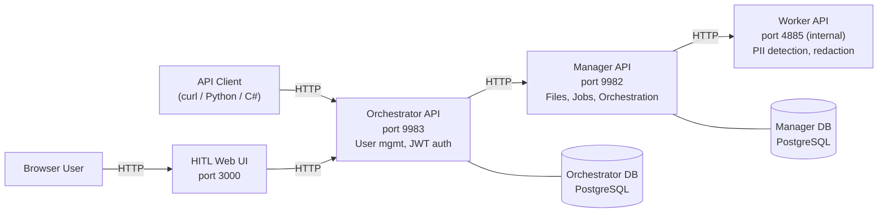

# Pdftools Smart Redact - Samples Repository

Sample configurations and examples for deploying and using [Smart Redact](https://www.pdf-tools.com/docs/smart-redact) by Pdftools.

Smart Redact automatically detects and redacts personally identifiable information (PII) in PDF documents using pattern matching, keyword detection, and ML-based named entity recognition (GLiNER).

## Architecture

Smart Redact consists of four services:



| Service          | Port | Description                                                                 |
| ---------------- | ---- | --------------------------------------------------------------------------- |
| **HITL Web UI**  | 3000 | Human-in-the-loop review interface for detection results and redaction jobs |
| **Orchestrator** | 9983 | Web UI backend with user management and JWT authentication                  |
| **Manager**      | 9982 | Client-facing API for file uploads and detection/redaction jobs             |
| **Worker**       | 4885 | Internal service that performs PII detection and redaction                  |

> For detailed architecture documentation, see [Smart Redact Architecture](https://www.pdf-tools.com/docs/smart-redact/architecture).

## Prerequisites

- [Docker](https://docs.docker.com/get-docker/) and [Docker Compose](https://docs.docker.com/compose/install/) v2+
- A valid Smart Redact license key — register at [portal.pdf-tools.com](https://portal.pdf-tools.com/) to generate a free trial key, or see the [licensing docs](https://www.pdf-tools.com/docs/smart-redact/licensing) for production keys.
- For GPU acceleration: NVIDIA GPU with [NVIDIA Container Toolkit](https://docs.nvidia.com/datacenter/cloud-native/container-toolkit/install-guide.html)

## Windows Users

The startup flow and API examples use bash. On Windows, use one of:

- **WSL2** (recommended) — full Linux environment. Docker Desktop integrates with WSL2 natively, so `docker` commands just work.
- **Git Bash** — bundled with [Git for Windows](https://git-scm.com/download/win). Sufficient for all Docker-based scripts in this repo, provided Docker Desktop is running and `python3` is available on `PATH` (needed by the curl API examples).

A standalone PowerShell key-generation helper is also included for manual key generation; `smart-redact.sh setup` generates keys automatically.

## Quick Start

The fastest way to get Smart Redact running:

**Prerequisites:** A valid Smart Redact license key — register at [portal.pdf-tools.com](https://portal.pdf-tools.com/) to generate a free trial key, or see the [licensing docs](https://www.pdf-tools.com/docs/smart-redact/licensing) for production keys.

```bash
# 1. Clone this repository
git clone https://github.com/pdf-tools/smart-redact-samples.git
cd smart-redact-samples

# 2. Create your .env file with generated secrets
./smart-redact.sh setup --license-key "<RDCTSRV,...>"

# 3. Start all services and wait for Docker health checks
./smart-redact.sh up

# 4. Show Compose-managed service status
./smart-redact.sh health

# Optional: stream logs
./smart-redact.sh logs
```

Once running:

- **HITL Web UI:** http://localhost:3000
- **Manager API (Swagger):** http://localhost:9982/swagger
- **Orchestrator API (Swagger):** http://localhost:9983/swagger

Default HITL / Orchestrator login:

- **Email:** `admin@example.com`
- **Password:** `Admin@1234!Tmp`

## Repository Structure

```
smart-redact-samples/
├── samples/                 # Sample documents for testing
│
├── docker-compose/          # Docker Compose deployments
│   ├── cpu/                 #   Full stack (CPU inference)
│   ├── gpu/                 #   Full stack (GPU inference, NVIDIA CUDA)
│   └── minimal/             #   Manager + Worker only (no Orchestrator)
│
├── docker-run/              # Individual docker run scripts
│
├── api-examples/            # API usage examples
│   ├── curl/                #   Shell scripts (step-by-step)
│   ├── python/              #   Python examples
│   └── csharp/              #   C# / .NET example
│
└── scripts/                 # Utility scripts
```

## Deployment Options

| Option                                              | Best For                             | Guide                             |
| --------------------------------------------------- | ------------------------------------ | --------------------------------- |
| [Docker Compose (CPU)](docker-compose/cpu/)         | Quick start, development, evaluation | [Guide](docker-compose/README.md) |
| [Docker Compose (GPU)](docker-compose/gpu/)         | Production with GPU acceleration     | [Guide](docker-compose/README.md) |
| [Docker Compose (Minimal)](docker-compose/minimal/) | API-only usage without Orchestrator  | [Guide](docker-compose/README.md) |
| [Docker Run](docker-run/)                           | Manual control over each container   | [Guide](docker-run/README.md)     |

## API Examples

See [api-examples/](api-examples/) for complete usage examples including:

- Uploading PDF files
- Running PII detection
- Downloading detection results
- Running PII redaction
- End-to-end workflows

> For full API reference, see [Smart Redact API Documentation](https://www.pdf-tools.com/docs/smart-redact/api-reference).

## Configuration Reference

All Smart Redact services are configured via environment variables:

| Variable                  | Required | Description                                                                                    |
| ------------------------- | -------- | ---------------------------------------------------------------------------------------------- |
| `PDFTOOLS_LICENSE_KEY`    | Yes      | Smart Redact license key                                                                       |
| `ENCRYPTION_KEY`          | Yes      | 32-byte Base64-encoded AES-256-GCM key                                                         |
| `ORCHESTRATOR_JWT_SECRET` | Yes\*    | JWT signing secret (min 32 chars). \*Only for Orchestrator.                                    |
| `VERSION`                 | No       | Docker image tag (default: `latest`)                                                           |
| `HITL_WEB_PORT`           | No       | Host port for the HITL Web UI (default: `3000`)                                                |
| `HITL_ORCHESTRATOR_URL`   | No       | Browser-facing Orchestrator API URL used by the HITL Web UI (default: `http://localhost:9983`) |

> For all configuration options, see [Smart Redact Configuration Guide](https://www.pdf-tools.com/docs/smart-redact/configuration).

## Documentation

- [Smart Redact Documentation](https://www.pdf-tools.com/docs/smart-redact)
- [Configuration Guide](https://www.pdf-tools.com/docs/smart-redact/configuration)
- [API Reference](https://www.pdf-tools.com/docs/smart-redact/api-reference)
- [Architecture](https://www.pdf-tools.com/docs/smart-redact/architecture)
- [Licensing](https://www.pdf-tools.com/docs/smart-redact/licensing)

## License

This repository contains sample configurations for Smart Redact, a commercial product by [PDF Tools AG](https://www.pdf-tools.com). A valid license key is required to run the service.
